<h1 align="center">Hyprdots</h1>

<div align="center">
<p>
<a href="https://github.com/ad1822/hyprdots/stargazers"><a>&nbsp;&nbsp;
<!-- <a href="https://github.com/ad1822/hyprdots/"></a>&nbsp;&nbsp; -->
<a href="https://github.com/ad1822/hyprdots/"></a>&nbsp;&nbsp;
<a href="https://github.com/ad1822/hyprdots/commits/main/"></a>&nbsp;&nbsp;
<a href="https://github.com/ad1822/hyprdots/blob/main/LICENSE"></a>&nbsp;&nbsp;
</p>
</div>

<p align="center">
  
</p>
<!-- <p align="center">
  <a href="https://github.com/zemmsoares/awesome-rices">
    
  </a>
</p> -->

<div align="center">
  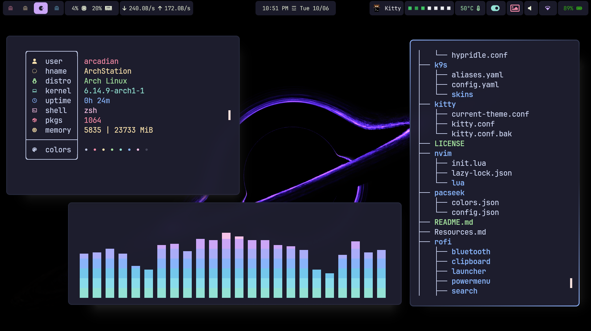
</div>

<div align="center">
  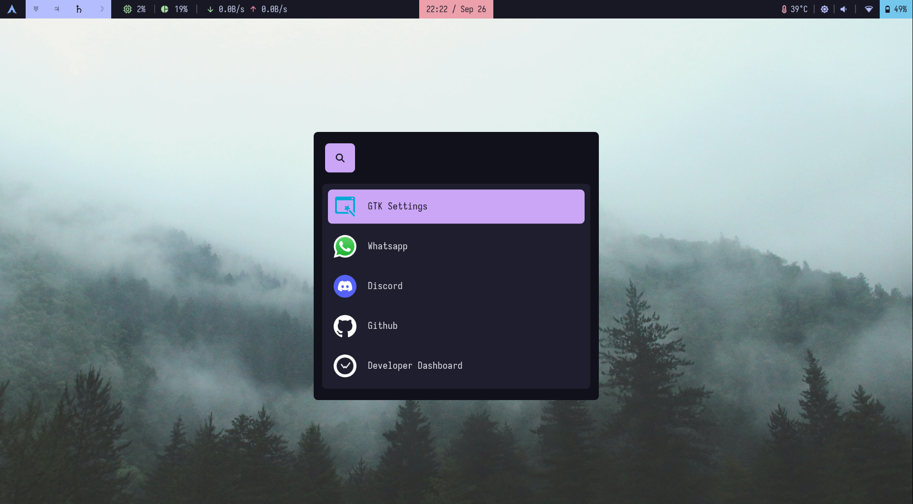
  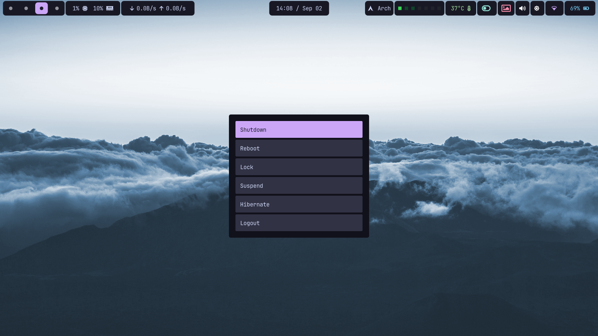
</div>


<div align="center">
  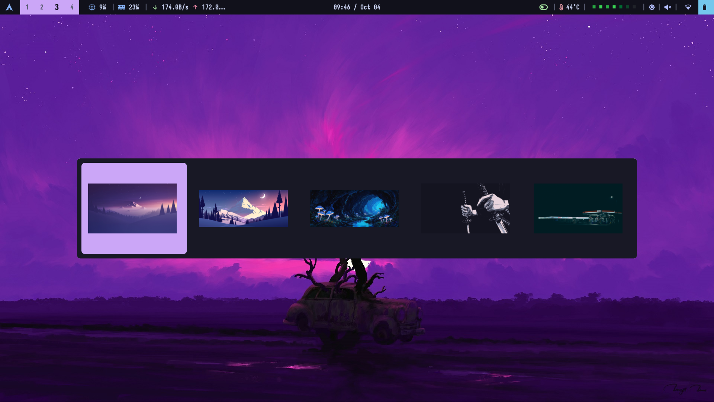
  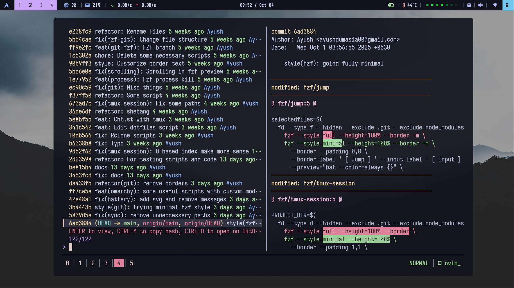
</div>

<div align="center">
  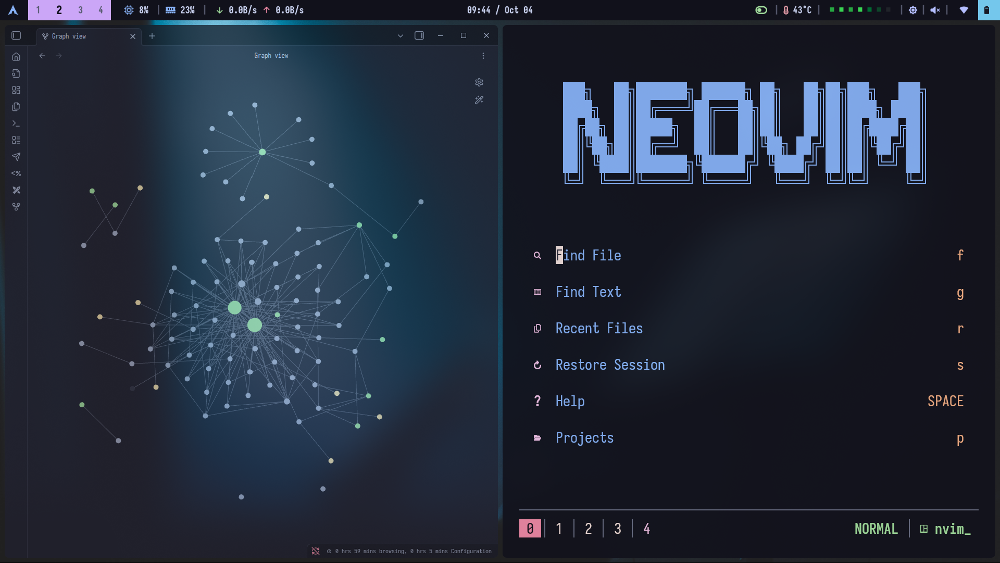
</div>

<div align="center">
  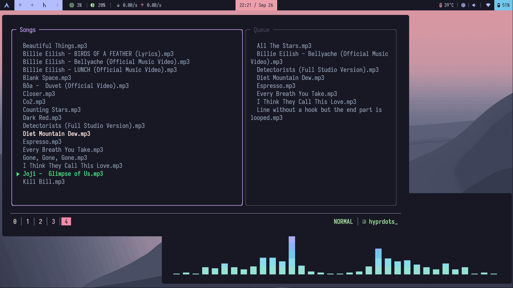
</div>

<div align="center">
  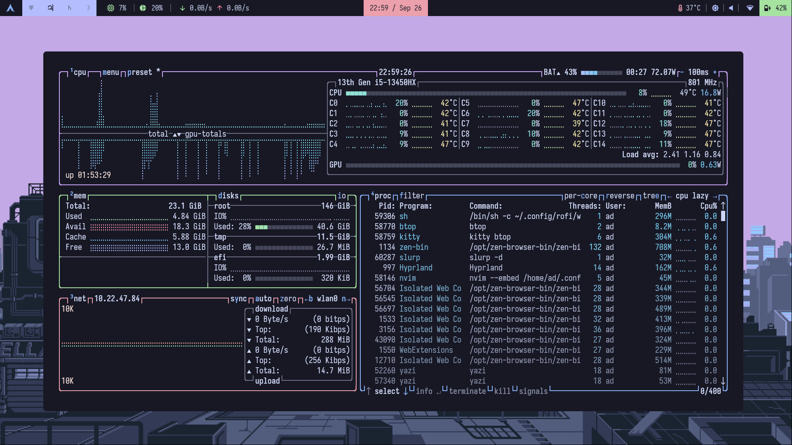
</div>

<div align="center">
  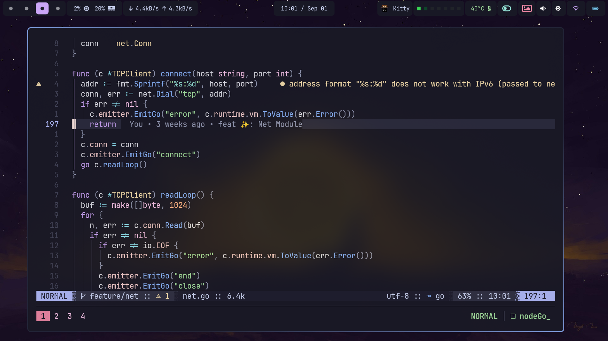
</div>

<div align="center">
  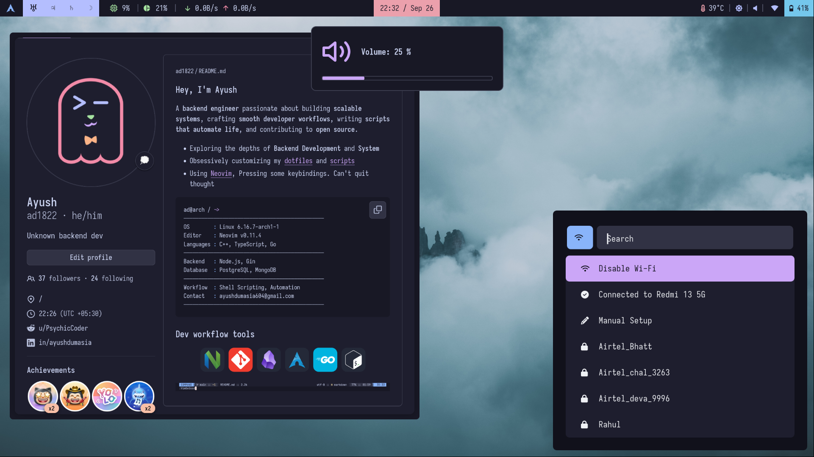
</div>

<div align="center">
  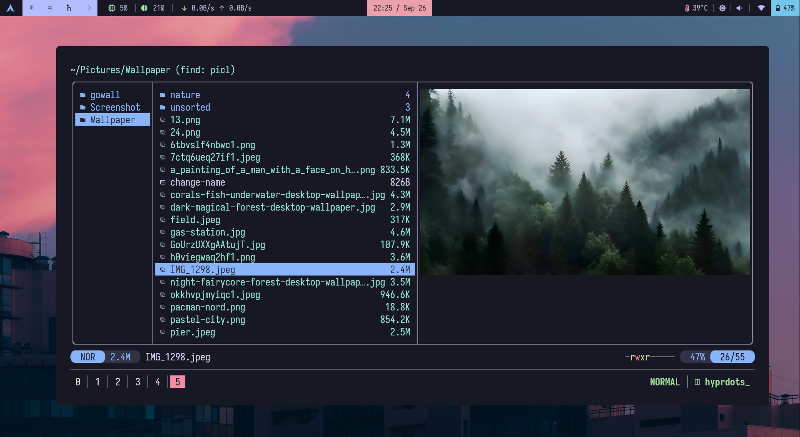
</div>

#### My old rice

Change branch of this repo to `old-dotfiles` 
```bash
git checkout old-dotfiles
```

## Wallpapers (Google Drive)

[Wallpapers](https://drive.google.com/drive/folders/1Q1j-Qzx1cU1X8j4xUPrssxn1rgJSnDQO)

---

## 🚀 Quick Installation Guide

### 📦 Programs Included

- **Window Manager**: Hyprland (Tiling)
- **Status Bar**: Waybar
- **Notification Manager**: Dunst
- **Browser**: Zen
- **Color Picker**: hyprpicker
- **Wallpaper Utility**: hyprpaper
- **Screenshot Utility**: grim + slurp
- **App Launcher**: Rofi
- **Terminal Emulator**: kitty
- **Shell**: Zsh
- **Media Controls**: playerctl
- **Power Management**: acpi
- **Brightness Control**: brightnessctl
- **Audio Management**: pamixer, PulseAudio
- **Network Management**: NetworkManager (nmcli), iwd (iNet Wireless Daemon)

> ℹ️ **For more detailed guidance**, check out [this](./Resources.md)

---

## 🛠️ Installation Steps

1. **Clone the repository** to your home directory like `~` or `/home/username` :

   ```sh
   git clone https://github.com/ad1822/hyprdots ~/hyprdots
   ```

2. **Navigate to the cloned directory**:

   ```sh
   cd ~/hyprdots
   ```

3. **Run the setup script**:

   ```sh
   bash ./setup.sh
   ```

4. **GTK Theme Setup**:

- [Catppuccin Gtk theme](https://github.com/catppuccin/gtk/releases)

- I use [`ngw-look`](https://github.com/nwg-piotr/nwg-look) to configure GTK themes and styles.

---

## ⚠️ Important Notice (Read Before Running Setup)

> ### **Warning:**
>
> This setup script will **move your existing config files** (e.g., for Waybar, Kitty, Hyprland, etc.) to a backup folder at `~/.config_backup`. Then, it will copy the new configs from this repo into your `~/.config` directory.
>
> ### What this means:
>
> - Your current setup will be **replaced**.
> - If you have customizations you care about, **back them up manually** or review the script before running.
> - Fonts and themes will be installed system-wide in your `~/.local/share/fonts` directory.

---

<p align="center">
  
</p>

---

## My Workflow

>- My setup remaps Caps Lock → Super (⌘) for faster window management and command access.
>- You can change this behavior in your Hyprland input configuration if you prefer the default key layout.
>- You can also enable animation in `hyprland`, My configuration have animation, but I have been not fan of animation

## Keybindings

| Shortcut                       | Action                                                      |
| ------------------------------ | ----------------------------------------------------------- |
| **`⌘ + T`**             | Open terminal                                               |
| **`⌘ + B`**             | Launch browser                                              |
| **`⌘ + W`**             | Close active window                                         |
| **`⌘ + V`**             | Toggle floating mode                                        |
| **`⌘ + F`**             | Enable fullscreen (mode 1)                                  |
| **`⌘ + G`**             | Disable fullscreen (mode 0)                                 |
| **`⌘ + N`**             | Launch floating Neovim Anywhere window                      |
| **`⌘ + O`**             | Launch Obsidian                                             |
| **`⌘ + E`**             | Open file manager in terminal                               |
| **`⌘ + P`**             | Open Rofi power menu (Rofi)                                        |
| **`⌘ + Space`**         | Launch Rofi app launcher (Rofi)                                   |
| **`⌘ + Shift + R`**     | Open wallpaper selector and reload Hyprpaper                |
| **`⌘ + Shift + S`**     | Take area screenshot using Grim & Slurp (copy to clipboard) |
| **`Print`**                    | Take area screenshot and save with Grimblast                |
| **`Alt + Shift + S`**          | Run custom screenshot script                                |
| **`Alt + Shift + W`**          | Restart Waybar                                              |
| **`Ctrl + Shift + Tab`**       | Open task manager in terminal                               |
| **`⌘ + C`**             | Launch color picker                                         |
| **`⌘ + I`**             | Change wallpaper and reload Hyprpaper                       |
| **`⌘ + M`**             | Launch Rofi clipboard manager (Rofi)                              |
| **`⌘ + Shift + L`**     | Lock screen using Hyprlock                                  |
| **`⌘ + A`**             | Launch Rofi Wi-Fi selector (Rofi)                                  |
| **`Alt + Tab`**                | Cycle to next window                                        |
| **`Alt + Shift + Tab`**        | Cycle to previous window                                    |
| **`⌘ + Tab`**           | Bring active window to top                                  |
| **`⌘ + H / J / K / L`** | Move focus (left / down / up / right)                       |

### Workspace Management

| Shortcut                       | Action                                          |
| ------------------------------ | ----------------------------------------------- |
| **`⌘ + 1–6`**           | Switch to workspace 1–6                         |
| **`⌘ + 0 / 9 / 8 / 7`** | Alternate workspace mapping (custom preference) |
| **`⌘ + Shift + [1–0]`** | Move active window to workspace 1–10            |

---

## Tmux Workflow

> **Prefix key:** `Ctrl + A`
> To enable these shortcuts, clone my **dotsh** repository containing all the custom scripts:

```bash
git clone https://github.com/ad1822/dotsh.git ~/work/main/dotsh
```

After cloning, update the paths in your Tmux configuration if your directory structure differs.

| Shortcut       | Description                                                                    |
| -------------- | ------------------------------------------------------------------------------ |
| **Prefix + i** | Launch *fzf-based cheatsheat* (`~/work/main/dotsh/fzf/ch`)                |
| **Prefix + t** | Open *fzf Tmux session switcher* (`~/work/main/dotsh/fzf/tmux-session`)        |
| **Prefix + d** | Edit dotfiles via *fzf-based selector* (`~/work/main/dotsh/fzf/edit-dotfiles`) |
| **Prefix + m** | Open *[mpterm](https://github.com/ad1822/mpterm)* — a minimal music player terminal                                r

---

